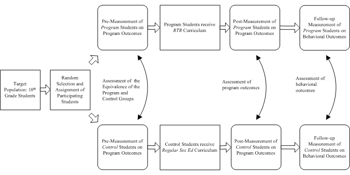
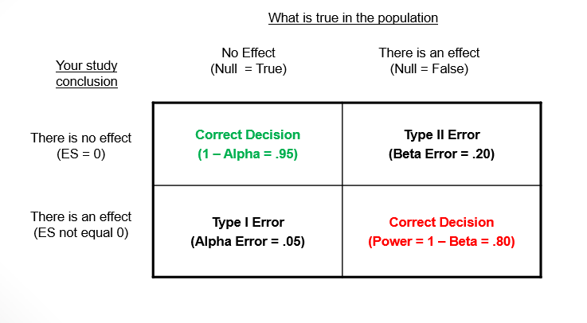
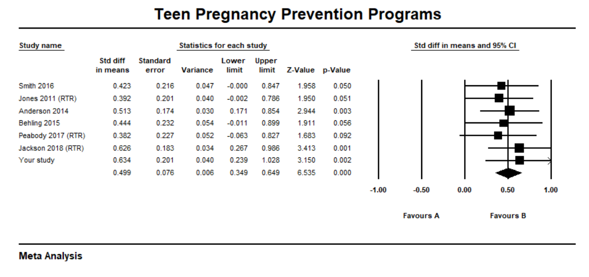

## Introduction 

This document is one of a series designed to illustrate how the R statistical computing environment can be used to conduct various types of social work research. In this report, we present an example of using R to plan and analyze an intervention evaluation study.   

### A case study

Say you are a social work researcher and have been contacted by a high school to assist in an evaluation project. The school has been using a proprietary evidence-based teen pregnancy prevention program --- *Reducing the Risk* (RTR) --- for a number of years but, because of budget considerations, is questioning the advisability of continuing to use the program in addition to the regular sex ed curriculum. The school has never evaluated the program so health and social work staff suggested that an evaluation of the program be conducted before it is possibly eliminated.

You suggest that the best evidence of program effectiveness would come from an experimental evaluation design. Despite the logistical difficulties of randomly selecting and randomly assigning students to study conditions in a school setting, you successfully make the argument that this type of design would be optimal in addressing the high stakes decision to eliminate or continue the program.

The working evaluation committee you chair settles on a randomized two-group pre-post evaluation design. Sexuality is covered in the 10th grade so the focus of the evaluation will be on 10th grade students. 

The evaluation design is shown in the following schematic: 



The steps in conducting the evaluation are:

* Select a random sample of students from the 10th grade population and randomly assigned students to either the RTR program group (intervention group) or the regular sex education group (control group). 
* Administer the pre-measurement instrument to both groups
* Carefully implement and manage exposure to RTR and regular sex education
* Administer the post-measurement instrument to both groups
* Conduct a follow-up survey designed to assess on-going behavioral changes

The primary outcome is measured as a single scale score representing the percent of correct or favorably rated items on an instrument designed to measure knowledge, attitudes, intentions, and behaviors addressed by RTR. The follow-up instrument asks questions about behavior, e.g., abstinence, consistent use of protection, and use of refusal skills. 

### Using R

R and various R packages are helpful tools in the project for the following tasks:

* Conducting a power analysis to determine sample size
* Conducting various statistical tests and effect sizes

The R packages necessary for the above tasks are:

```{r message=FALSE, warning=FALSE}
##Load Libraries
library(knitr)        ## An engine for dynamic report generation with R
library(dplyr)        ## System for data transformations
library(ggplot2)      ## Graphics system
library(effectsize)   ## Computes indexes of effect Sizes and standardized parameters
library(pwr)          ## Computes power analyses
```

```{r setup, include=FALSE}
knitr::opts_chunk$set(echo = TRUE)
```

#### Power analysis

A power analysis is conducted in the planning stage of a study to ensure that sample sizes are large enough to detect a substantive difference between the progam group and the control group on the outcome measure. Various reviews have concluded that many social work research studies are underpowered – some seriously so. The implication of this conclusion is that researchers may have missed important contributions to knowledge about a topic because of an inattention to power. 

The concept of power in rooted in null hypothesis statistical testing. The NHST process works generally as follows:

* Study hypothesis is converted into a null hypothesis and a research hypothesis --- in this study the null hypothesis is that there is no difference between the RTR and regular sex ed students on the outcome measure, the research hypothesis is that there is is a difference between the groups in favor of RTR students 
* Select a ‘level of significance’ – the general convention is p <= .05 but it can be any value 
* Select and run an appropriate statistical test
* Make decision: If p is > .05, you fail to reject the null hypothesis; If p is <= .05, you reject null hypothesis – you conclude there is evidence that your research hypothesis exists in the population of interest 
  
The NHST decision framework looks like this:




You can see there are two possible correct decisions --- 1) concluding there is no effect when there is no effect in the population, and 2) concluding there is an effect when there is an effect in the population. There has tended to be a traditional focus on decision 1 where setting alpha error directly impacts the probability of making a correct decision. Setting alpha to .05 indicates that you are willing to make a Type 1 error (finding things that aren't there) 5 times out of 100 or, stated differently, you are willing to make a correct decision 95 times out of 100. Power looks at things a little differently by focusing on decision 2. For example, a power probability of .80 indicates we are willing to making a correct decision (finding things that are there) about an effect if the one exists in the population 80 times out of 100. 

Power is a function of these four inter-related components:

* The estimated magnitude of an effect size as it exists in the population
* A decision about setting Type I error 
* The necessary sample size
* A decision about making a correct decision about effects in the population – this is actually referred to as the ‘power’ of a study

The components of power form a closed system – if any three are known, the fourth is determined. While there are variations, a power analysis usually requires the following:

* You supply an estimate of the size of the effect in the population
* You set alpha – as noted above, it is often by convention p <= .05
* In most studies, your interest is in finding out what sample size you need to have a sufficient chance of finding a true effect in your population
* You set the power threshold – it is often by convention >= .80

The statistical test you plan to use for the post-measurement mean comparison is a two sample t-test and a Cohen's *d* standardized mean difference effect size. In the Cohen effect size interpretation framework, a *d* = .3 is a small effect size, *d* = .5 is a medium effect size, and *d* = .8 is a large effect size. The reason this is important at this stage is that one of the parameters you have to specify in the power analysis is the population effect size.  Since you don't know what that value is, one way to improve your estimate is to look at the literature about teen pregnancy prevention intervention. For example, say you find a meta-analysis of studies using a standardized mean difference effect size and determine that these studies locate around a medium (.48) effect size across studies. Given this evidence, you decide to use a .5 population value in your power analysis.


The R code to determine the sample size necessary for the study is as follows: 

```{r}
## Planning power analysis
pwr.t.test(d = .5, sig.level=.05, power=.8, type="two.sample")
```

These results indicate that you need 64 students in each group to detect a medium effect size, with alpha set to .05, and power set to .80.  

### Data analysis

#### Preliminaries. 

The first step in the data analysis process is to load your data into R. R is versatile in reading many types of data files (e.g., SPSS, Stata, SAS). For applied researchers who may not have access to proprietary packages, data files can be created as delimited text files (.dat, .txt) in text editors. Also, Excel is quite versatile for data entry and exports a comma separated values (.csv) file format that works well in R. The following code loads a .csv file and lists the first few records to make sure your data set is in order. 

```{r message=FALSE, warning=FALSE}
##Load Data
data <- read.csv("rtr2.csv", header=TRUE)  ##load a comma separated values (.csv) file
head(data, 3) ## list a first few records to check your data set
```

Next, you tabulate group means:

```{r message=FALSE, warning=FALSE}
## Compute group means
pre.post <- data %>%
  group_by(group) %>%
  summarize(
    pre = mean(pretest),
    post = mean(posttest) 
  ) 
pre.post
```

#### Pre-measurement differences.

The pre-measurement means for the groups (Control = 49.7, Program = 50.2) are very close in value. An assumption of randomization is that study groups are theoretically equivalent and the fact that the pre-means were so close in value suggests that the equivalence assumption was true for at least the outcome measure. 

#### Post-measurement differences.

The post-measurement means for the groups (Control = 59.4, Program = 67.3) indicated that the program students, on the average, scored higher on the outcome than the control group. You formally test this difference using a two sample t-test and a Cohen's *d* effect size.  

```{r, results='hold'}
##t-test of posttest with Cohen's d Effect Size
options(digits = 5)
t.test(posttest ~ group, data=data)
cohens_d(posttest ~ group, data=data)
```

The obtained t-test results are *t*(126) = -3.56, *p* = 0.00  and Cohen's *d* = -.63. In NHST terms, you reject the null hypothesis of no difference between the groups and concluded that there was a statistically significant difference in favor of the RTR group. Cohen's *d* is a measure of the magnitude of the difference in standard deviation units. The RTR group was, on the average, .63 standard deviation units above the regular sex ed students. In the Cohen interpretation framework, this effect size is in the medium to large range.  

#### Follow-up differences.

Since one of the goals of RTR is to encourage abstinence, you focus your three-month follow-up analysis on a simple yes-no question about whether or not a student had been abstinent during that time period. You can display your results in a grouped bar chart:  

```{r, fig.width = 4 ,fig.height = 3, fig.align = 'center'}
##Follow-up Graph
ggplot(data) +
  geom_bar(mapping = aes(x=followup, fill = group), position = "dodge") +
  scale_fill_manual(values = c("steelblue","lightgreen")) +
  labs(x = "Abstained", y = "Frequency")
```

The 2x2 crosstabulation of group and abstinence is shown as follows:    

```{r}
## Follow-up proportions
options(digits = 1)
follow <- xtabs(~ group + followup, data = data)
(prop.table(follow, 1))
```

These results suggest there is a difference between groups on reported abstinence with 91% of the RTR group responding 'Yes' compared to 75% of the control group responding 'Yes'. The standard statistical test for assessing 2x2 tables is the Chi-squared test. In addition, a common effect size measure for 2x2 is phi. 

```{r, results='hold'}
## Follow-up effect sizes
options(digits = 5)
(Xsq <- chisq.test(follow))
(effectsize(Xsq, type = "phi"))
```

The obtained chi-squared results are *X^2^*(1) = 4.45, *p* = .035 and phi = .21. In NHST terms, you reject the null hypothesis of no difference between the groups and concluded that there is a statistically significant association in favor of higher abstinence in RTR group. Phi can be interpreted as a correlation coefficient (*r*) and can be interpreted the Cohen effect size framework where an *r* = .1 is a small effect size, *r* = .3 is a medium effect size, and *r* = .5 is a large effect size. Our obtained phi is between a small and medium effect size. 

### Conclusions and recommendations

This is a summary of conclusions reported to school leadership:

* The evaluation committee successfully planned and implemented an experimental research design to assess the RTR program
* Primary findings were:
   + There was both a *statistical* and *practical* difference between the RTR group and the control group on the outcome measure in favor of the RTR group; Cohen's *d* fell into the medium to large effect size range 
   + There was both a *statistical* and *practical* difference between the RTR group and the control group on the follow-up measure of abstinence in favor of the RTR group; phi fell into the small to medium effect size range
* The committee recommendation is that the RTR program appears to add value to the regular sex ed curriculum and that continued use of the program is advisable 

Finally, because the evaluation was a high quality experimental design, the committee urged you to write it up and submit it to a reputable social work research journal. You do so and some time later you notice that it is included in an updated meta-analysis of teen pregnancy prevention. 



Congratulations, you helped to conduct a high quality study and added to a growing knowledge base...

If you are interested in R after reading this document, feel free to contact Jerry Bean (bean.8@osu.edu) for more information. It has become his (my) mission to encourage the use of R in social work doctoral training and social work research, in general.
